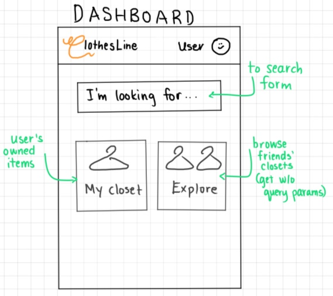
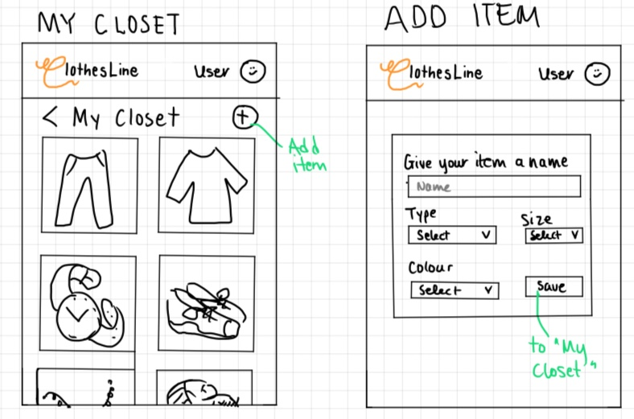
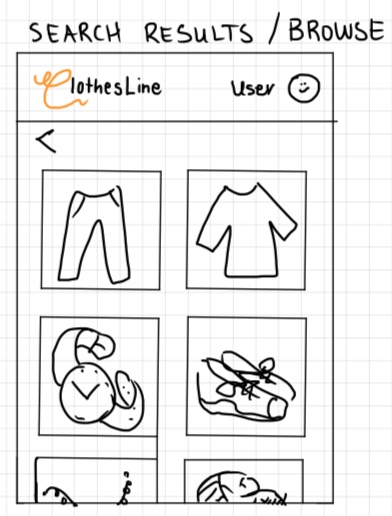
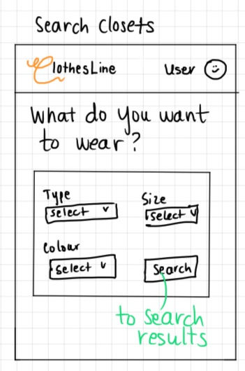

# Project Title
ClothesLine

## Overview
ClothesLine lets you connect with your friends and share clothing.

### Problem
- as living spaces become more compact
- focus on sustainability and not producing waste
- economical
- community-building


<!-- Third-wave coffee is coffee made with high-quality beans typically sourced from individual farms and roasted more lightly to bring out their distinctive flavors. There is no certain way to know the quality of a café's coffee before purchasing and having your first sip. When looking for a third-wave café in a given area, people generally have to go through the time-consuming process of doing a Google search for coffee near a location then manually analyze images, reviews, etc. for each café before deciding if it might be a café serving a high-quality cup of third-wave coffee. -->

### User Profile
Friends and small communities
- People who want to cut down on their warddrobe without cutting down on their options
- Enjoys wearing different things / trying new styles

### Features
- As a logged in user, I want to easily upload pieces to my online wardrobe
    - Name (text input), type (select), color (select), size (select) --> should be dynamic depending on type
- As a logged in user, I want to connect with friends' accounts
- As a logged in user, I want to see my friends' online wardrobes
- As a logged in user, I want to search for items within my community according to parameters (same as above in uploading)

## Implementation

### Tech Stack
- React
- JavaScript
- MySQL
- Express
- Client libraries: 
    - react
    - react-router
    - axios
- Server libraries:
    - knex
    - express
    - multer

### APIs
- No external APIs

### Sitemap
- Register
- Login
- User Dashboard
- Item pages
    - browse all items
    - see results based on search queries
- Closet pages (closet-specific item pages)
    - Personal closet
    - Friend's closet
- Friend/Closet list (list of friends that links to their wardrobe)

### Mockups

#### Dashboard Page


#### My Closet Page / Add Item Page


#### Browse Closet Page


#### Search Form



### Data


### Endpoints

**GET /items**
- Get a list of items
Parameters:
- user id?
- JWD token

Optional query parameters (for search):
- type, colour, size

Response: 
```
[
    {
        "id":1,
        "username": "user123"
        "type": "shoes",
        "colour": "black",
        "size": "9",
        "image": "image.jpg",
    },
    {
        "id":46,
        "username": "otherUser"
        "type": "shoes",
        "colour": "black",
        "size": "9",
        "image": "image.jpg",
    },
    ...
]
```

**GET /items/:itemId**
- Get an item's details

Parameters:
- item id

Response:
```
{
    "id":1,
    "type": "shoes",
    "colour": "black",
    "size": "9/41",
    "image": "image.jpg",
}
```
If id not found, 404. If successful, 201.

**POST /items**
- Add an item to your closet

Parameters:
- user id
- JWT token
- type
- colour
- size
- photo

Response:
```
{
    "id": 1,
    "type": "jacket",
    "colour": "red",
    "size": "M/8/28",
    "image": "image.jpg",
}
```

**GET /users***
- Get all users

Response body:
```
[
    {
        "id": 1,
        "username": "user123",
        "email": "user@email.com",
    },
    {
        "id", 2,
        "username": "user456",
        "email": "best_user@email.com"
    },
    ...
]
```

**GET /users/:userId**
- Get user's information/profile; used in tandem with /:userId/items endpoint to display a user's closet

Parameters:
- user id

Response:
```
{
    "id": 1,
    "username": "user123", 
    "email":"user@email.com",
}
```

**GET /users/:userId/items**

- Get user's closet (list of items associated with that user id)

Parameters:
- user id
- JWT token

Response:
```
[
    {
        "id":1,
        "username": "user123"
        "type": "shoes",
        "colour": "black",
        "size": "9",
        "image": "image.jpg"
    },
    {
        "id":2,
        "username": "user123"
        "type": "earrings",
        "colour": "gold",
        "size": "N/A",
        "image": "image.jpg"
    },
    ...
]
```

**POST /register**

- Add a user account

Parameters:
- username: User chosen display name
- email: User's email
- password: User's provided password

Response:
```
{
    "token": "seyJhbGciOiJIUzI1NiIsInR5cCI6IkpXVCJ9.eyJzdWIiOiIxMjM0NTY3ODkwIiwibmFtZSI6I..."
}
```

**POST /login**

- Login a user

Parameters:
- email: User's email
- password: User's provided password

Response:
```
{
    "token": "seyJhbGciOiJIUzI1NiIsInR5cCI6IkpXVCJ9.eyJzdWIiOiIxMjM0NTY3ODkwIiwibmFtZSI6I..."
}
```


### Auth

- JWT auth
    - Before adding auth, all API requests will be using a fake user with id 1
    - Added after core features have first been implemented
    - Store JWT in localStorage, remove when a user logs out


## Roadmap

- Create client
    - react project with routes and boilerplate pages

- Create server
    - express project with routing, with placeholder 200 responses

- Create migrations

- Create seeds for:
    - users
    - clothing items
    - closets
    - friendships - include at least one sample friendship between two users

- Deploy client and server projects so all commits will be reflected in production

- Feature: Get user by id
    - Create GET /users/:userId endpoint
    - Implement basic structure of user profile (closet page)

- Feature: Get items
    - Create GET /items endpoint
    - Implement browse/explore page (list of all items)
        - ItemsList component
        - Item component

- Feature: View item
    - Implement item details page
    - Link to existing Item component
    - Create GET /items/:itemId endpoint

- Feature: Get items by user id
    - Create GET /users/:userId/items endpoint
    - Reuse ItemsList component in user profile

- Feature: Add item
    - Implement Add Item page/form
    - Create POST /items endpoint

- Feature: Dashboard
    - Links to:
        - Search form (search items)
        - Explore page (all items) 
        - My closet (user's items)
        - Add item (to user's own closet)

- Feature: Create account
    - Implement register page + form
    - Create POST /users/register endpoint

- Feature: Login
    - Implement login page + form
    - Create POST /users/login endpoint

- Feature: Implement JWT tokens
    - Server: Update expected requests / responses on protected endpoints
    - Client: Store JWT in local storage, include JWT on axios calls

- Feature: Friends page
    - Implement friend list page (links to friends' closets)
    - Create GET /users endpoint

- Bug fixes

- DEMO DAY

## Nice-to-haves

- Integrate adding friends (seeded in first sprint)
- Forgot password functionality