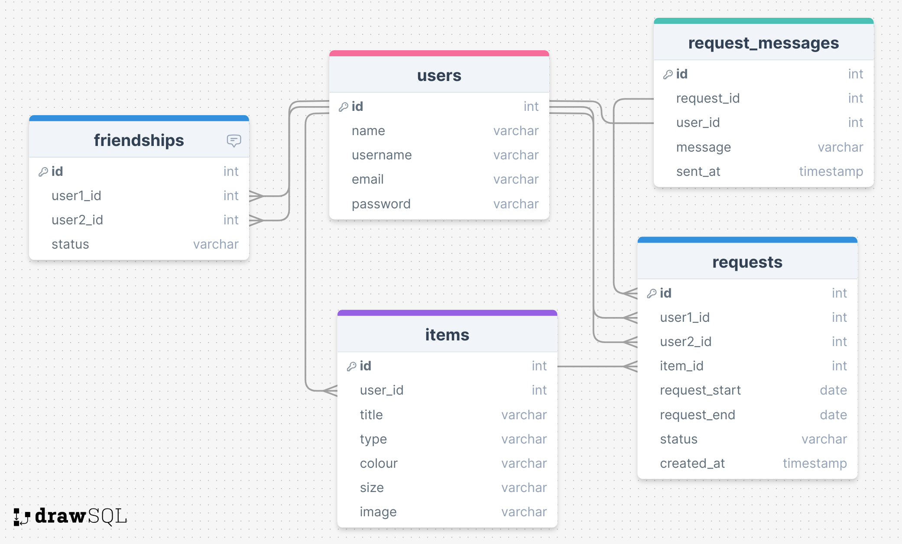

# Project Title
ClothesLine

## Overview
ClothesLine lets you connect with your friends and share clothing.

### Problem
The shift toward more compact, high-density housing models, as well as trends in sustainability and waste-reduction, have impacted how consumers are able to buy and store their wardrobes. Many people are shifting toward either paring down their wardrobes, and thus their fashion choices, or sourcing extra storage in order to maintain their larger wardrobe. ClothesLine would allow people to have smaller individual wardrobes while continuing to have access to a variety of styles via their larger clothing network.

### User Profile
ClothesLine is made for friends, families, and small communities who want to build a connected, trusting space to share clothing with each other. Users who are looking to minimize their purchasing or downsize their closet will benefit from the endless possibilities that come from sharing different styles with others.

### Features
- Once logged in, users can:
    - Add items to their closet
    - Browse their friends' closets
    - Search for specific styles
    - Request items from friends
    - Respond to requests from friends

## Implementation

### Tech Stack
- React
- JavaScript
- MySQL
- Express
- Client libraries: 
    - react
    - react-router
    - axios
- Server libraries:
    - knex
    - express
    - multer

### APIs
- No external APIs

### Sitemap
- Register
- Login
- User Dashboard
- My Closet page:
    - View uploaded items
    - Upload new items
- Explore page:
    - Browse all friends' items with the option of filtering for specific styles or sizes
    - Click individual items to send a request to friends
- Closet pages:
    - Browse the items that one friend has uploaded to their closet

### Screenshots

#### Dashboard Page


#### My Closet Page


#### Explore Page


#### Requests


### Data



### Endpoints

**ITEM Routes**

**GET /items**
- Get a list of friends' items

Parameters:
- JWT

Optional query parameters:
- type, colour, size

Response: 
```
[
    {
        "id": 8,
        "title": "Long wool dresscoat",
        "size": "L/10/30",
        "image": "wool-coat.png",
        "first_name": "Evelyn"
    },
    {
        "id": 9,
        "title": "Pleated skirt",
        "size": "XS/2/26",
        "image": "pleat-skirt.png",
        "first_name": "Zhenyi"
    },
    ...
]
```

**POST /items**
- Add an item to your closet

Parameters:
- user id
- title
- type
- colour
- size
- image

Response:
```
{
    "id": 1,
    "user_id": 25,
    "title": "Red rain jacket",
    "type": "jacket",
    "colour": "red",
    "size": "M/8/28",
    "image": "image.jpg",
}
```

**GET /items/:itemId**
- Get an item's details

Parameters:
- item id
- JWT

Response:
```
{
    "id": 8,
    "title": "Long wool dresscoat",
    "type": "outerwear",
    "colour": "brown",
    "size": "L/10/30",
    "image": "wool-coat.png",
    "user_id": 3,
    "first_name": "Evelyn"
}
```
---
**USER Routes**

**GET /users/active**
- Get active user after login

Parameters:
- JWT

Response:
```
{
    "firstName": "Jane",
    "lastName": "Sample",
    "email": "jane.sample@email.com",
    "id": 1
}
```

**GET /:userId**
- Get user's name

Parameters:
- user id
- JWT

Response:
```
{
    "first_name": "Grace",
    "last_name": "Hopper"
}
```

**GET /users/:userId/items**

- Get user's closet (list of items associated with that user id)

Parameters:
- user id
- JWT token

Response:
```
[
  {
    "id": 9,
    "title": "Pleated skirt",
    "type": "skirt",
    "colour": "green",
    "size": "XS/2/26",
    "image": "pleat-skirt.png"
  },
  {
    "id": 10,
    "title": "DW Watch",
    "type": "accessory",
    "colour": "gold",
    "size": "N/A",
    "image": "dw-watch.png"
  },
    ...
]
```
---
**REQUEST Routes**

**GET /requests**
- Get all requests associated with active user

Parameters:
- JWT

Response:
```
{
    "incoming": [
    {
        "id": 4,
        "user1_id": 3,
        "title": "Parka",
        "image": "parka.jpg",
        "first_name": "Evelyn"
    }
    ],
    "outgoing": [
    {
        "id": 1,
        "user1_id": 1,
        "title": "Winter boots",
        "image": "boots.jpg",
        "first_name": "Misty"
    },
    ],
    "history": ...
}
```

**GET /requests/:requestId**
- Get request details

Parameters:
- JWT

Response:
```
{
  "id": 3,
  "item_id": 2,
  "user1_id": 3,
  "message": "Hi! Can I borrow these for Sam's wedding?",
  "status": "accepted",
  "title": "Black pumps",
  "size": "9",
  "image": "black-shoes.png",
  "first_name": "Evelyn"
}
```

**DELETE /requests/:requestId**
- Cancel a pending outgoing request

Parameters:
- JWT

**PUT /requests/:requestId**
- Accept or decline a pending incoming request

Parameters:
- JWT

Response:
```
{
  "id": 3,
  "user1_id": 3,
  "user2_id": 1,
  "item_id": 2,
  "message": "Hi! Can I borrow these for Sam's wedding?",
  "status": "declined",
  "date": "1706809948000"
}
```

**POST /requests/:itemId**
- Send a request

Parameters:
- JWT

```
{
  "id": 7,
  "user1_id": 1,
  "user2_id": 2,
  "item_id": 4,
  "message": "Can I please borrow this next week?",
  "status": "pending",
  "date": "1715059025542"
}
```

---
**AUTH Routes**

**POST /auth/register**
- Register a new user

Parameters:
- first_name, last_name, email, password

Response:
```
{
  "id": 6,
  "first_name": "Jane",
  "last_name": "Doe",
  "email": "jdoe@email.com",
  "password": "123456"
}
```

**POST /auth/login**

- Login a user

Parameters:
- email, password

Response:
```
{
    "token": "seyJhbGciOiJIUzI1NiIsInR5cCI6IkpXVCJ9.eyJzdWIiOiIxMjM0NTY3ODkwIiwibmFtZSI6I..."
}
```


### Auth

- JWT auth
    - Store JWT in localStorage, remove when a user logs out


## Next steps

- Implement searching for and adding friends
- Implement editing and deleting items from closet
- Add date field when sending a request
- Forgot password functionality